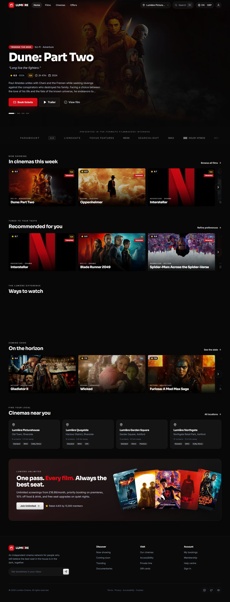
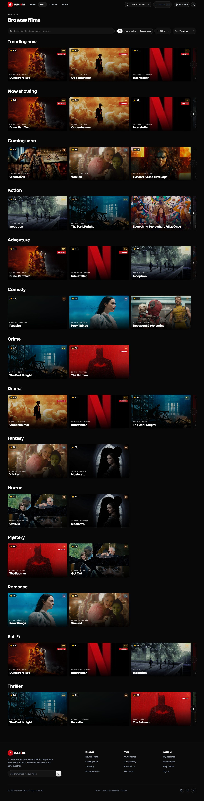
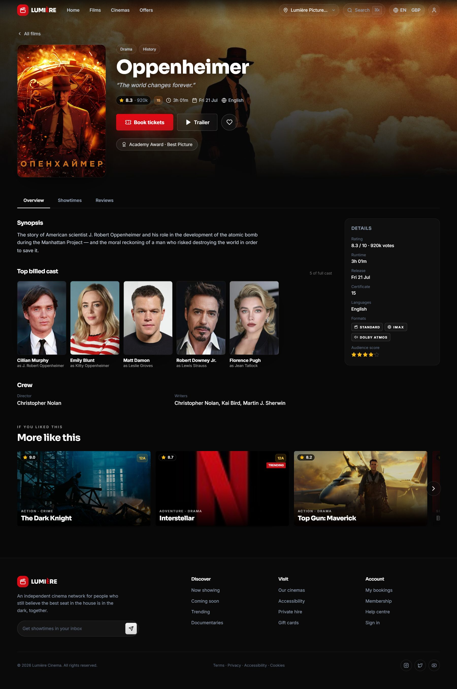

# 🎬 Lumière — Cinema & Ticketing 🍂

A modern, premium, **white‑label cinema website** — film discovery, social reviews and a complete seat‑booking flow, wrapped in a flat‑black, Netflix‑grade UI.

Built with **React + TypeScript + Vite + Tailwind CSS**, animated with **Framer Motion**, and powered by **real film data and imagery from [TMDB](https://www.themoviedb.org/)**.



## About

Lumière is a front-end template for a cinema website: browsing films, reading and writing reviews, and booking seats. It is meant for cinema chains, studios or agencies that want a ready-made UI to rebrand and connect to their own film and ticketing API. The current version is a front end only: film data is a static TMDB-based demo set and payment is simulated.

---

## ✨ Highlights

- **Cinematic, full‑bleed UI** — edge‑to‑edge layout, deep blacks, a rotating hero billboard and horizontal, **drag‑to‑scroll** rails with momentum.
- **Real catalogue** — 20 real films with authentic posters, landscape backdrops, synopses, ratings and **real cast headshots** (sourced from TMDB).
- **Advanced discovery** — a command‑palette search (`⌘K` / `Ctrl‑K`) plus a browse page with genre rows, live filtering by genre, format, certificate, language and rating, and shareable URL state.
- **Full booking flow** — film → showtimes → **interactive curved seat map** → checkout → confirmation, with a persistent mini‑cart.
- **Interactive seat selection** — curved auditorium with perspective, premium & accessible seats, hover pricing, a **“best available” auto‑picker**, and simulated **live availability**.
- **Social** — ratings, threaded review discussions and a write‑a‑review form.
- **Account dashboard** — profile + loyalty, upcoming/past bookings with QR passes, add‑to‑calendar & directions, watchlist and a taste‑insights panel.
- **i18n & currency** — English / Español / Français and GBP / EUR / USD, applied instantly across the app.
- **Recommendations** — content‑based engine using genre, crew and format affinity.
- **Responsive & accessible** — works from mobile to ultrawide; semantic markup, focus rings and ARIA labels throughout.

---

## 🖼️ Screenshots

### Browse — Netflix‑style genre rows & filtering


### Film detail — backdrop, real cast portraits, showtimes & reviews


---

## 🧱 Tech stack

| Concern | Choice |
| --- | --- |
| Framework | [React 18](https://react.dev/) + [TypeScript](https://www.typescriptlang.org/) |
| Build tool | [Vite 5](https://vitejs.dev/) |
| Styling | [Tailwind CSS 3](https://tailwindcss.com/) (custom theme) |
| Animation | [Framer Motion](https://www.framer.com/motion/) |
| State | [Zustand](https://github.com/pmndrs/zustand) (with `localStorage` persistence) |
| Routing | [React Router 6](https://reactrouter.com/) (lazy‑loaded routes) |
| Icons | [lucide‑react](https://lucide.dev/) |

---

## 🚀 Getting started

```bash
# 1. install dependencies
npm install

# 2. start the dev server (http://localhost:5173)
npm run dev

# 3. type-check + production build
npm run build

# 4. preview the production build
npm run preview
```

> Requires Node 18+ (developed on Node 20/25).

---

## 📁 Project structure

```
src/
├─ components/
│  ├─ layout/      # Navbar, Footer, BookingBar, SearchOverlay, Layout
│  ├─ home/        # Hero billboard
│  ├─ film/        # ShowtimesPicker, Reviews
│  ├─ seats/       # SeatMap (curved auditorium)
│  └─ ui/          # FilmCard, FilmRail, Poster, CastPortrait, Brand, Rating, …
├─ pages/          # Home, Browse, FilmDetail, Seats, Checkout, Confirmation,
│                  #   Cinemas, Offers, Account, NotFound
├─ store/          # useBookingStore, usePreferences (Zustand)
├─ data/           # films, cinemas, showtimes, reviews, castPhotos (TMDB)
├─ lib/            # i18n, recommendations, posterArt, format helpers
└─ hooks/          # useLocale, useClickOutside
```

---

## 🗺️ Routes

| Path | Page |
| --- | --- |
| `/` | Home — hero, partner marquee, discovery rails, membership |
| `/browse` | Browse — genre rows + advanced filters / search |
| `/film/:slug` | Film detail — overview, showtimes, reviews, cast |
| `/cinemas` | Locations, amenities and today’s screenings |
| `/offers` | Membership tiers & deals |
| `/seats/:showtimeId` | Interactive seat selection |
| `/checkout` | Ticket types, contact & payment |
| `/confirmation/:ref` | Booking confirmation + wallet pass |
| `/account` | Profile, bookings, watchlist, preferences |

---

## 🎨 Design system

- **Palette** — flat near‑black surfaces (`ink.*`), an off‑white “platinum” primary accent, and a signature **crimson red** for the brand mark and booking CTAs. Amber is reserved for star ratings.
- **Type** — `Sora` for display headings, `Inter` for body.
- **Motion** — hero cross‑fades, scroll‑reveals, card hover‑scale, an infinite partner‑logo marquee, animated counters and momentum‑based rail dragging.
- **Imagery** — real TMDB posters/backdrops with a procedural gradient fallback (`PosterArt`) so a card never shows a broken image.

---

## 🔧 White‑labelling

This is a **brand‑agnostic template**. To rebrand:

1. Rename the wordmark in `components/layout/Navbar.tsx` and `Footer.tsx`.
2. Adjust the accent colours in `tailwind.config.js`.
3. Swap the network in `data/cinemas.ts`.
4. Replace the static arrays in `data/films.ts` (and `castPhotos.ts`) with your real CMS/API feed — the UI is already structured around typed models.

---

## 📝 Data & attribution

Film metadata, posters, backdrops and cast headshots are sourced from
**[The Movie Database (TMDB)](https://www.themoviedb.org/)** for demonstration
purposes. This product uses the TMDB API but is **not endorsed or certified by
TMDB**. Images are loaded from the public TMDB image CDN. Swap `src/data/*` for
your own licensed content before production use.

Payment is **simulated** — no real transactions occur.

---

## 📄 License

The code is MIT-licensed — see [LICENSE](LICENSE). Film data and posters come from TMDB and are not
covered: replace them with your own licensed content before any commercial deployment.
